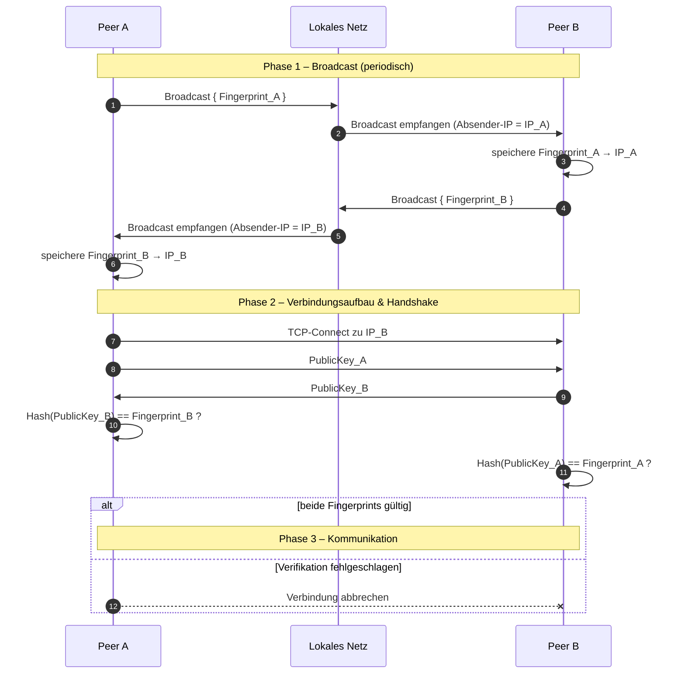

# ADR-002: Lokal Discovery & Handshake

- **Datum:** 2026-04-21
- **Status:** `Vorgeschlagen`
- **Erstellt von:** Janis E.

---

## Kontext

Als Nutzer möchte ich vertrauenswürdige Geräte/Peers registrieren und verwalten können, ohne Nutzerkonten anlegen zu müssen. Vertrauenswürdige Geräte sollen jederzeit hinzugefügt oder entfernt werden können. Basierend auf dieser Registrierung soll eine sichere Verbindung zu den Peers möglich sein, ohne dass feste IP-Adressen erforderlich sind.

**Akzeptanzkriterien:**
1. Keine Anlegung von Nutzerkonten erforderlich (keine persönlichen Daten wie E-Mail)
2. Mehrere Geräte können als vertrauenswürdig registriert werden
3. Registrierte Geräte können jederzeit entfernt werden
4. Basierend auf der Registrierung sind sichere Verbindungen möglich

## Entscheidung

Implementierung eines zwei-phasigen Ansatzes:

1. **Broadcast-Phase**: Clients versenden periodisch ihren Fingerprint per Broadcast/Multicast ins lokale Netz. Empfänger extrahieren die Absender-IP aus dem UDP-Paket und speichern die Zuordnung `Fingerprint → IP` lokal ab.
2. **Handshake-Phase**: Beim Verbindungsaufbau findet ein Public-Key-Austausch statt, gefolgt von beidseitiger Fingerprint-Verifikation. Nur wenn beide Seiten positive Verifikation bestätigen, wird die Verbindung aufgebaut.

## Begründung

Dieser dezentralisierte Ansatz ermöglicht:
- **Keine Nutzerkonten erforderlich**: Geräte werden direkt über ihre Fingerprints identifiziert und verwaltet
- **Einfache Peer-Verwaltung**: Vertrauenswürdige Geräte können über eine lokale Registrierung ohne zentrale Infrastruktur verwaltet werden
- **Dynamische IP-Verwaltung**: Keine festen IP-Adressen erforderlich – Geräte werden durch Fingerprints identifiziert
- **Gegenseitige Authentifizierung** durch Fingerprint-Verifikation basierend auf Public Keys
- **Sicherheit durch Trust-by-Verification**: Verbindungen sind nur zu registrierten Peers möglich
- **Skalierbarkeit** im lokalen Netz ohne Single-Point-of-Failure

### Betrachtete Alternativen

| Alternative | Begründung für Ablehnung |
|---|---|
| Nur Fingerprint-basierte Zuordnung ohne Public-Key-Austausch | Unzureichende Sicherheit, keine Forward-Secrecy, anfällig für Man-in-the-Middle-Attacken |
| Einseitiges Vertrauensmodell | Asymmetrisches Sicherheitsmodell, höheres Risiko bei Gerätekompromittierung |

## Konsequenzen

### Positiv
- Dezentralisierte Architektur ohne externe Abhängigkeiten
- **Keine festen IP-Adressen erforderlich** – Geräte können sich frei im Netz bewegen
- Gegenseitige Authentifizierung erhöht Sicherheit
- Geringe Latenz durch direkten TCP-Verbindungsaufbau nach Entdeckung
- Einfache Trust-Verwaltung: nur vertrauenswürdige Fingerprints akzeptieren

### Negativ / Trade-offs
- Periodische Broadcasts können zu erhöhtem Netzwerk-Traffic führen
- Discovery-Tabelle muss in Speicher verwaltet werden (bei vielen Geräten)
- Abhängig von Broadcast/Multicast-Unterstützung im Netzwerk
- Port-Management erforderlich (Standardport festlegen oder im Broadcast übertragen)
- Vertrauenswürdige Fingerprints müssen vorab bereitgestellt werden

## Detaillierte Spezifikation

### Broadcast

**Kurzfassung:** Clients verschicken ihren Fingerprint im Intervall ins Netz. Empfänger lesen die Absender-IP aus der Nachricht und speichern jede eingehende Zuordnung `Fingerprint → IP` lokal ab.

Jeder Client sendet in einem festen Intervall eine Broadcast-/Multicast-Nachricht mit seinem Fingerprint ins lokale Netz. Empfänger lesen die Absender-IP aus dem UDP-Paket und speichern die Zuordnung `Fingerprint → IP` in einer Discovery-Tabelle – unabhängig davon, ob der Fingerprint bereits als vertrauenswürdig bekannt ist. Die Trust-Prüfung findet erst beim Verbindungsaufbau statt.

*Hinweis: Port sollte entweder im Broadcast mitgesendet oder als Standardport festgelegt werden (erforderlich für Verbindungsaufbau).*

### Verbindung aufbauen (Handshake)

**Kurzfassung:**
- Beim Verbindungsaufbau tauschen beide Partner ihre Public Keys aus.
- Aus den empfangenen Public Keys wird jeweils der Fingerprint berechnet und mit den lokal hinterlegten Fingerprints vertrauenswürdiger Geräte abgeglichen.
- Nur wenn die Fingerprints auf beiden Seiten einem vertrauenswürdigen Gerät entsprechen, wird die Verbindung aufgebaut.

**Im Detail:**

1. Peer A ermittelt die aktuelle IP von Peer B aus der Discovery-Tabelle (anhand des Fingerprints).
2. Peer A baut eine TCP-Verbindung zu dieser IP auf.
3. Beide Partner tauschen ihre Public Keys aus.
4. Beidseitige Fingerprint-Verifikation: Jede Seite berechnet den Fingerprint des empfangenen Public Keys und vergleicht ihn mit dem lokal gespeicherten, vertrauenswürdigen Fingerprint der Gegenseite.
5. Nur wenn **beide** Seiten ein positives Ergebnis haben, gilt die Gegenseite als authentifiziert und die Nutzdaten werden anschließend mit dem Public Key des Empfängers verschlüsselt.

### Ablaufdiagramm

